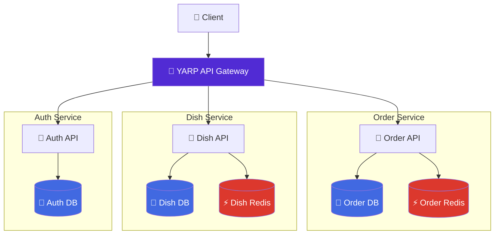

# 🍽️ Food Delivery Microservices

[](https://dotnet.microsoft.com/en-us/download/dotnet/9.0)
[](https://www.docker.com/)
[](https://microsoft.github.io/reverse-proxy/)
[](https://www.postgresql.org/)
[](https://redis.io/)
[](https://opensource.org/licenses/MIT)

A small collection of **.NET microservices** (Auth, Dishes, Orders) wired together behind a simple API Gateway and orchestrated with **Docker Compose**. All services use **PostgreSQL** for persistence, and the Dish/Order services use **Redis** for caching. The project is split into submodules so each service can be developed independently.

---

## ⚡ Features

* Independent microservices for **authentication**, **dish management**, and **order management**
* API Gateway that routes/aggregates requests to backend services
* Docker Compose orchestration (databases, caches, volumes, networks)
* Healthchecks for service readiness
* Environment-driven configuration (single `.env` example included)
* Ready-for-local testing with Compose and containerized DBs

---

## 🧭 Architecture



Each service exposes a small HTTP API and a `/health` endpoint used by Docker Compose healthchecks.

---

## 🛠 Prerequisites

* Docker (20.10+ recommended)
* Docker Compose v2 (or `docker compose` plugin)
* (Optional) Git (to clone with submodules)

> **Note:** You do not need the .NET SDK to run the whole stack if you use Docker Compose. The services run as container images built from each submodule.

---

## 🚀 Quick Start

```bash
# 1. Clone the repository with all microservices (submodules)
git clone --recursive https://github.com/dxrkblxss/food-delivery-microservices.git

# 2. Go to project directory
cd food-delivery-microservices

# 3. Configure environment variables (required before start):
cp .env.example .env
# No changes needed for a quick test, 
# but recommended to edit for production.

# 4. Spin up the entire infrastructure
docker-compose up -d --build
```

> [!IMPORTANT]
> Once the containers are running, the API Gateway is accessible at
> `http://localhost:8080`

---

## ⚙️ Configuration

Copy the example env file and edit secrets:

```bash
cp .env.example .env
# Edit .env and replace the placeholder passwords / JWT_KEY
```

`.env.example` contains the main variables used by `docker-compose.yml`:

* `ASPNETCORE_ENVIRONMENT` - environment (Development/Production)

**Auth service**

* `AUTH_DB_NAME`, `AUTH_DB_USER`, `AUTH_DB_PASSWORD`
* `JWT_KEY` (must be at least ~32 chars for HMAC signing)

**Dish service**

* `DISH_DB_NAME`, `DISH_DB_USER`, `DISH_DB_PASSWORD`

**Order service**

* `ORDER_DB_NAME`, `ORDER_DB_USER`, `ORDER_DB_PASSWORD`

> [!TIP]
> You can generate a secure 32-character key using:
> `openssl rand -base64 32`

---

## 🛠️ Run (development / local testing)

Start the whole stack (builds images from submodules):

```bash
# from repository root
docker compose up --build
```

Or run in detached mode:

```bash
docker compose up -d --build
```

Compose will create the required Postgres containers and the Redis caches used by Dish/Order services, then expose the API Gateway on port **8080** (host -> container mapping `8080:80`).

To stop and remove containers, networks and volumes created by Compose:

```bash
docker compose down -v
```

---

## 🔎 API Discovery & Documentation

The project uses **Swagger UI** for easy API exploration and testing. Thanks to the Gateway's aggregation, you can view all service definitions in one place.

* **🚀 Centralized Swagger UI:** `http://localhost:8080/gateway-docs` 
  *(Use the definition selector in the top right to switch between Auth, Dishes, and Orders)*

* **Gateway Base URL:** `http://localhost:8080`

If you need to access individual service documentation directly through the gateway:
* 🔐 **Auth Service:** `http://localhost:8080/auth/swagger`
* 🥘 **Dish Service:** `http://localhost:8080/dishes/swagger`
* 🛒 **Order Service:** `http://localhost:8080/orders/swagger`

> [!TIP]
> Swagger is enabled by default in `Development` environment. If you change `ASPNETCORE_ENVIRONMENT` to `Production` in your `.env`, Swagger UI might be disabled depending on your service configuration.

---

## 🧪 Development (per-service)

If you want to develop one of the services locally (recommended):

1. Open the service folder (e.g. `auth-service/`, `dish-service/`, `order-service/`).
2. If you have the .NET SDK installed you can run the service directly:

```bash
cd auth-service
# restore & run (example)
dotnet restore
dotnet run --launch-profile Development
```

3. Or build and run the service container with Docker from the service folder:

```bash
docker build -t auth-service:dev .
# run with appropriate env vars pointing to the DB containers from the Compose network
```

> [!TIP]
> When running containers manually, make sure they can access the other containers they need on the same Docker network.
> Usually, it's:
> ```bash
> docker run --network food-delivery-microservices_default ...
> ```

---

## 🧩 Tips & Troubleshooting

* If Compose reports a service unhealthy, check that the service started correctly and that the DB connection string values in `.env` match the Compose service names.
* Inspect logs with:

```bash
docker compose logs -f
# or for a single service
docker compose logs -f auth-service
```

* If you change `.env` values, re-create containers to pick up new environment variables:

```bash
docker compose down -v
docker compose up -d --build
```

* Database data is persisted to named volumes defined in `docker-compose.yml`.

---

## 🛠️ What you can extend

* Add a frontend service (React/Vue) and proxy requests through the API Gateway
* Add service-to-service authorization / RBAC in the Auth service
* Add message broker (e.g. RabbitMQ) for async order processing
* Add CI/CD workflows to publish images to a registry and run integration tests

---

## 📄 License

This project is released under the MIT License. See `LICENSE` for details.
